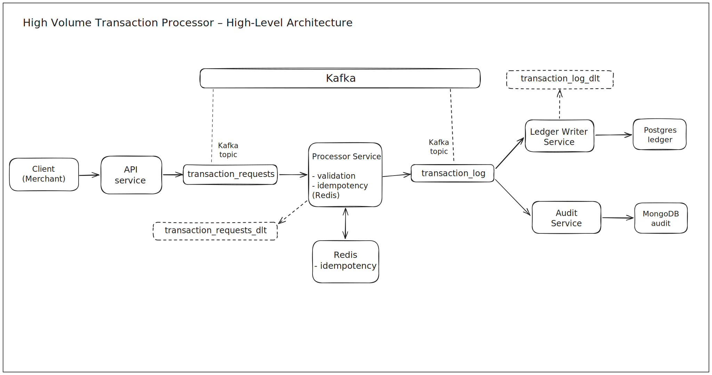
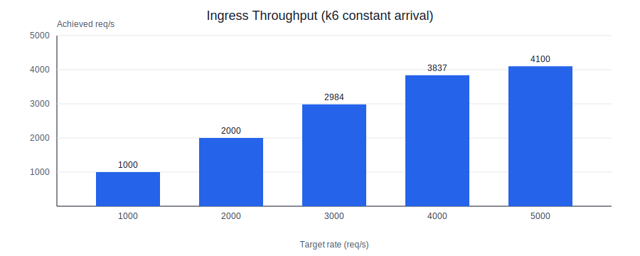

# High Volume Transaction Processor

High Volume Transaction Processor is a production-style, event-driven transaction pipeline built with Java 21, Spring Boot, Kafka, Redis, PostgreSQL, MongoDB, and k6.

The repository is structured like a small payment platform:

- signed transaction ingestion over HTTP
- asynchronous processing over Kafka
- Redis-backed idempotency protection
- ledger persistence in PostgreSQL
- immutable audit persistence in MongoDB
- dead-letter topics for failed records
- webhook notifications for transaction state changes
- Actuator and Prometheus endpoints on every service

## What This Project Demonstrates

- Event-driven microservices with clearly separated write responsibilities
- Per-account ordering by using `accountId` as the Kafka message key
- Idempotency enforcement in the processor with Redis TTL-backed keys
- PostgreSQL as the ledger source of truth for persisted transactions
- MongoDB as an append-only audit store
- Reconciliation between the audit store and the ledger
- Replay support for rebuilding ledger state from `transaction_log`
- Signed ingress requests and API-key-protected status reads

## Service Map

| Service | Responsibility | Main Dependencies | Local Port |
| --- | --- | --- | --- |
| `api-service` | Accept signed transaction requests, publish `transaction_requests`, expose status endpoint | Kafka, Postgres, Redis | `8080` |
| `processor-service` | Validate requests, enforce idempotency, publish `transaction_log`, send `ACCEPTED`/`REJECTED`/`FAILED` webhooks | Kafka, Redis | `8081` |
| `ledger-writer-service` | Batch-persist accepted transactions, run reconciliation, optionally replay `transaction_log`, send `PERSISTED`/`FAILED` webhooks | Kafka, Postgres, MongoDB | `8082` |
| `audit-service` | Persist immutable audit events from `transaction_log` | Kafka, MongoDB | `8083` |
| `common-model` | Shared request, event, enum, and webhook payload contracts | N/A | N/A |

## High-Level Architecture

```text
Client
  |
  | POST /api/v1/transactions (signed)
  v
api-service
  |
  v
Kafka topic: transaction_requests
  |
  v
processor-service
  |  - validation
  |  - Redis idempotency
  |  - webhook: ACCEPTED / REJECTED / FAILED
  v
Kafka topic: transaction_log
  | \
  |  \
  |   \--> audit-service -----------> MongoDB transaction_audit_events
  |
  \------> ledger-writer-service --> PostgreSQL ledger_entries
               |
               +--> reconciliation against MongoDB audit events
               +--> optional replay from transaction_log
               +--> webhook: PERSISTED / FAILED

Client
  |
  | GET /api/v1/transactions/{id}/status (X-API-Key)
  v
api-service --> PostgreSQL ledger_entries
```



More detail: [Architecture Overview](docs/architecture.md)

## Quick Start

### Prerequisites

- Docker and Docker Compose
- Optional: JDK 21 if you want to run services outside Docker
- Optional: k6 for load testing

### Start The Full Stack

1. Copy `.env.example` to `.env`.
2. Set at least:

```env
POSTGRES_PASSWORD=postgres
APP_MERCHANT_DEMO_SALT_KEY=merchant-demo-secret-key
```

3. If you want to use the status endpoint locally, also add a read API key:

```env
APP_READ_API_KEYS=read-key-demo
APP_READ_API_KEY_MERCHANTS=read-key-demo:merchant-demo
APP_READ_RATE_LIMITS=read-key-demo:120
```

4. Start everything:

```bash
docker compose up --build
```

5. Check the services:

```bash
curl http://localhost:8080/actuator/health
curl http://localhost:8081/actuator/health
curl http://localhost:8082/actuator/health
curl http://localhost:8083/actuator/health
```

6. Helpful local entry points:

- OpenAPI JSON: `http://localhost:8080/v3/api-docs`
- Swagger UI assets: `http://localhost:8080/swagger-ui/index.html`
- Ping: `http://localhost:8080/ping`

> [!NOTE]
> The bundled Swagger UI includes custom JavaScript that auto-populates demo signing headers for `merchant-demo`, which is the easiest way to try the write API manually.

### Stop The Stack

```bash
docker compose down
```

## Working With The API

### Submit A Transaction

`POST /api/v1/transactions` requires these headers:

- `X-Merchant-Id`
- `X-Timestamp`
- `X-Nonce`
- `X-Verify`
- `Idempotency-Key`
- `X-Correlation-Id` (optional but recommended)

The verify header format used by the API and the k6 scripts is:

```text
X-Verify = SHA256_HEX_UPPER(BASE64(body) + path + timestamp + nonce + idempotencyKey + saltKey) + "###" + saltIndex
```

Example request body:

```json
{
  "idempotencyKey": "idem-20260320-0001",
  "accountId": "acct-1001",
  "amount": 1500.75,
  "currency": "INR",
  "type": "CREDIT",
  "callbackUrl": "https://merchant.example/webhook"
}
```

For working signing examples, see:

- [`performance/k6/payload.js`](/home/kaustubh/Desktop/projects/Java/high-volume-transaction-processor/performance/k6/payload.js)
- [`performance/k6/new-transaction-load.js`](/home/kaustubh/Desktop/projects/Java/high-volume-transaction-processor/performance/k6/new-transaction-load.js)

### Read Transaction Status

`GET /api/v1/transactions/{transactionId}/status` requires:

- `X-API-Key`
- a matching merchant mapping for that API key

Example:

```bash
curl \
  -H 'X-API-Key: read-key-demo' \
  http://localhost:8080/api/v1/transactions/<transactionId>/status
```

> [!IMPORTANT]
> The status endpoint currently reads from `ledger_entries` in PostgreSQL. In the current implementation, that means local runs typically return `PERSISTED` for successfully written transactions and `404` for transactions that are still in-flight, rejected as duplicates, or failed before ledger persistence.

## Kafka Topics

- `transaction_requests` for signed inbound transaction requests
- `transaction_log` for validated transaction events
- `transaction_requests_dlt` for failed request records after retries or non-retryable errors
- `transaction_log_dlt` for failed log records after retries or non-retryable errors

More detail: [Kafka Topics & Event Contracts](docs/kafka-topics.md)

## Load Testing

k6 scripts live in `performance/k6` and automatically generate the required request signing headers.

Example:

```bash
k6 run \
  -e BASE_URL=http://localhost:8080 \
  -e MODE=constant \
  -e RATE=100 \
  -e DURATION=60s \
  -e PRE_ALLOCATED_VUS=50 \
  -e MAX_VUS=300 \
  performance/k6/transaction-load.js
```

Performance chart from local ingress testing:



These results measure HTTP ingress throughput for the API service using [`performance/k6/new-transaction-load.js`](/home/kaustubh/Desktop/projects/Java/high-volume-transaction-processor/performance/k6/new-transaction-load.js). A `202` response means the request was accepted for asynchronous processing, not that downstream persistence already completed.

More detail: [Load Testing](docs/load-testing.md)

## Observability

Every service exposes:

- `/actuator/health`
- `/actuator/info`
- `/actuator/prometheus`

The API service also propagates `X-Correlation-Id` to responses and downstream events, which makes it easier to follow a transaction through logs, Kafka events, and webhook payloads.

More detail: [Observability](docs/observability.md)

## Testing

Run the full test suite from the repository root:

```bash
./mvnw test
./mvnw verify
```

`verify` also generates aggregate JaCoCo coverage output under `target/site/jacoco-aggregate`.

More detail: [Testing](docs/testing.md)

## Documentation Index

- [Architecture Overview](docs/architecture.md)
- [Configuration](docs/configuration.md)
- [Kafka Topics & Event Contracts](docs/kafka-topics.md)
- [Design Decisions & Trade-offs](docs/design.md)
- [Testing](docs/testing.md)
- [Observability](docs/observability.md)
- [Load Testing](docs/load-testing.md)
- [Running Locally](docs/running-locally.md)
- [UML Diagrams](docs/uml/diagrams.md)
- [Data Model / ER Diagram](docs/db/er-diagram.md)

## License

MIT License. See [LICENSE](LICENSE).
