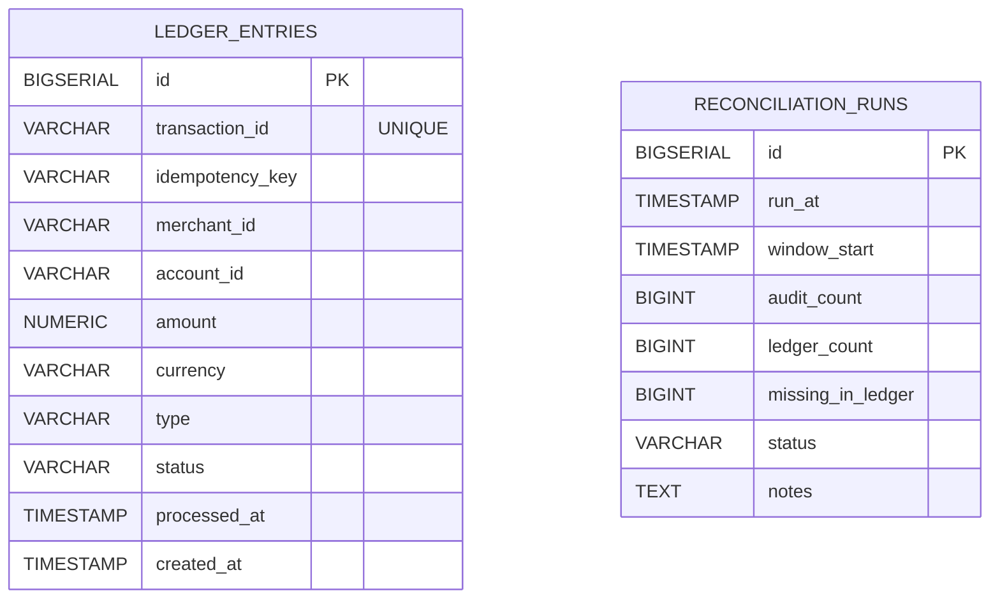
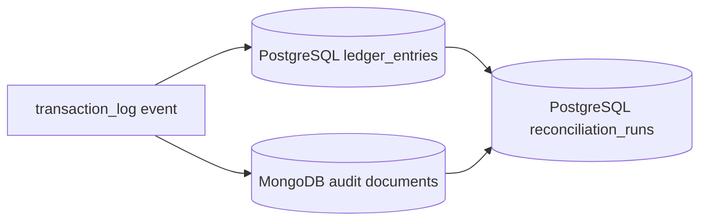

# Data Model / ER Diagram

This project uses two persistence models:

- PostgreSQL for ledger and reconciliation data
- MongoDB for immutable audit documents

## PostgreSQL Schema

### `ledger_entries`

Written by: `ledger-writer-service`

Purpose:

- durable ledger record for accepted transactions
- backing store for the status endpoint

Important columns:

- `transaction_id`
- `idempotency_key`
- `merchant_id`
- `account_id`
- `amount`
- `currency`
- `type`
- `status`
- `processed_at`
- `created_at`

Important constraints:

- unique index on `transaction_id`
- unique index on `(account_id, idempotency_key)`

### `reconciliation_runs`

Written by: `ledger-writer-service`

Purpose:

- stores periodic reconciliation summaries between MongoDB audit events and PostgreSQL ledger rows for a recent time window

Important columns:

- `run_at`
- `window_start`
- `audit_count`
- `ledger_count`
- `missing_in_ledger`
- `status`
- `notes`

## PostgreSQL ER Diagram

There are no foreign keys between these tables. `reconciliation_runs` is an operational summary table, not a child table of `ledger_entries`.

## MongoDB Audit Documents

The audit payload stored by `audit-service` contains:

- `id`
- `eventId`
- `transactionId`
- `idempotencyKey`
- `merchantId`
- `accountId`
- `correlationId`
- `amount`
- `currency`
- `type`
- `status`
- `processedAt`
- `storedAt`
- `sourceTopic`

Indexed fields in the audit service document model:

- `transactionId`
- `idempotencyKey`
- `merchantId`
- `accountId`
- `correlationId`

> [!NOTE]
> `ledger-writer-service` reconciliation currently queries MongoDB through `AuditEventDocument`, which is explicitly mapped to the `transaction_audit_events` collection. `audit-service` persists `TransactionAuditEventDocument` with an implicit Spring Data collection name. If you change Mongo mappings, keep both services aligned so reconciliation reads the same audit data the audit service writes.

## Logical Relationships Across Stores

There is no cross-database foreign key enforcement, but these logical relationships matter operationally:

- `ledger_entries.transaction_id` should match the audit document `transactionId` for accepted transactions
- reconciliation compares recent transaction IDs across both stores
- the status endpoint reads PostgreSQL only

