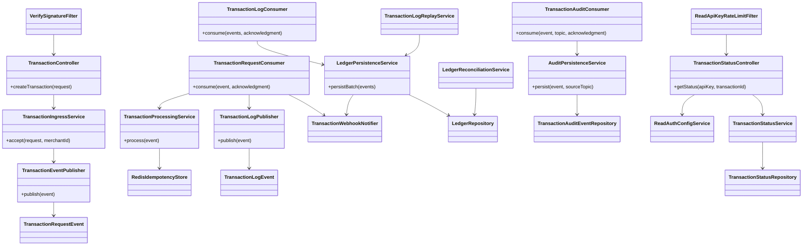
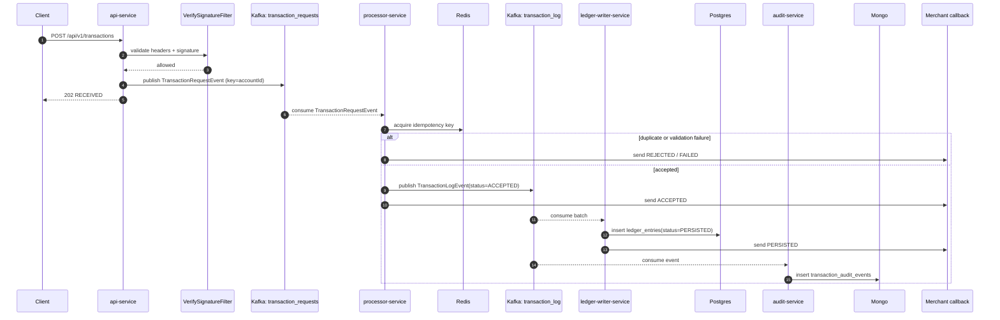
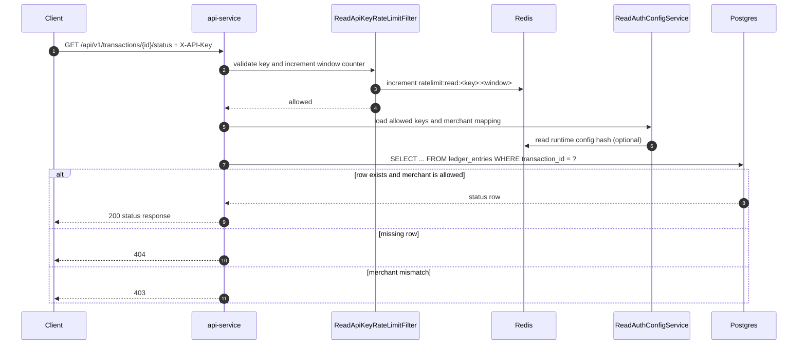

# UML Diagrams

These diagrams are conceptual views of the current implementation.

## Class Diagram

```mermaid
classDiagram
    class TransactionController {
      +createTransaction(request)
    }
    class VerifySignatureFilter
    class TransactionIngressService {
      +accept(request, merchantId)
    }
    class TransactionEventPublisher {
      +publish(event)
    }
    class TransactionRequestEvent

    VerifySignatureFilter --> TransactionController
    TransactionController --> TransactionIngressService
    TransactionIngressService --> TransactionEventPublisher
    TransactionEventPublisher --> TransactionRequestEvent

    class TransactionRequestConsumer {
      +consume(event, acknowledgment)
    }
    class TransactionProcessingService {
      +process(event)
    }
    class RedisIdempotencyStore
    class TransactionLogPublisher {
      +publish(event)
    }
    class TransactionWebhookNotifier
    class TransactionLogEvent

    TransactionRequestConsumer --> TransactionProcessingService
    TransactionRequestConsumer --> TransactionLogPublisher
    TransactionRequestConsumer --> TransactionWebhookNotifier
    TransactionProcessingService --> RedisIdempotencyStore
    TransactionLogPublisher --> TransactionLogEvent

    class TransactionLogConsumer {
      +consume(events, acknowledgment)
    }
    class LedgerPersistenceService {
      +persistBatch(events)
    }
    class LedgerRepository
    class LedgerReconciliationService
    class TransactionLogReplayService

    TransactionLogConsumer --> LedgerPersistenceService
    LedgerPersistenceService --> LedgerRepository
    LedgerPersistenceService --> TransactionWebhookNotifier
    LedgerReconciliationService --> LedgerRepository
    TransactionLogReplayService --> LedgerPersistenceService

    class TransactionAuditConsumer {
      +consume(event, topic, acknowledgment)
    }
    class AuditPersistenceService {
      +persist(event, sourceTopic)
    }
    class TransactionAuditEventRepository

    TransactionAuditConsumer --> AuditPersistenceService
    AuditPersistenceService --> TransactionAuditEventRepository

    class TransactionStatusController {
      +getStatus(apiKey, transactionId)
    }
    class ReadApiKeyRateLimitFilter
    class ReadAuthConfigService
    class TransactionStatusService
    class TransactionStatusRepository

    ReadApiKeyRateLimitFilter --> TransactionStatusController
    TransactionStatusController --> ReadAuthConfigService
    TransactionStatusController --> TransactionStatusService
    TransactionStatusService --> TransactionStatusRepository
```

## Sequence Diagram: Write Path

```mermaid
sequenceDiagram
    autonumber
    participant Client
    participant API as api-service
    participant Verify as VerifySignatureFilter
    participant TR as Kafka: transaction_requests
    participant Processor as processor-service
    participant Redis
    participant TL as Kafka: transaction_log
    participant Ledger as ledger-writer-service
    participant Postgres
    participant Audit as audit-service
    participant Mongo
    participant Webhook as Merchant callback

    Client->>API: POST /api/v1/transactions
    API->>Verify: validate headers + signature
    Verify-->>API: allowed
    API->>TR: publish TransactionRequestEvent (key=accountId)
    API-->>Client: 202 RECEIVED

    TR-->>Processor: consume TransactionRequestEvent
    Processor->>Redis: acquire idempotency key
    alt duplicate or validation failure
        Processor->>Webhook: send REJECTED / FAILED
    else accepted
        Processor->>TL: publish TransactionLogEvent(status=ACCEPTED)
        Processor->>Webhook: send ACCEPTED
        TL-->>Ledger: consume batch
        Ledger->>Postgres: insert ledger_entries(status=PERSISTED)
        Ledger->>Webhook: send PERSISTED
        TL-->>Audit: consume event
        Audit->>Mongo: insert transaction_audit_events
    end
```

## Sequence Diagram: Status Read Path

```mermaid
sequenceDiagram
    autonumber
    participant Client
    participant API as api-service
    participant RateLimit as ReadApiKeyRateLimitFilter
    participant Redis
    participant ReadAuth as ReadAuthConfigService
    participant Postgres

    Client->>API: GET /api/v1/transactions/{id}/status + X-API-Key
    API->>RateLimit: validate key and increment window counter
    RateLimit->>Redis: increment ratelimit:read:<key>:<window>
    RateLimit-->>API: allowed
    API->>ReadAuth: load allowed keys and merchant mapping
    ReadAuth->>Redis: read runtime config hash (optional)
    API->>Postgres: SELECT ... FROM ledger_entries WHERE transaction_id = ?
    alt row exists and merchant is allowed
        Postgres-->>API: status row
        API-->>Client: 200 status response
    else missing row
        API-->>Client: 404
    else merchant mismatch
        API-->>Client: 403
    end
```
